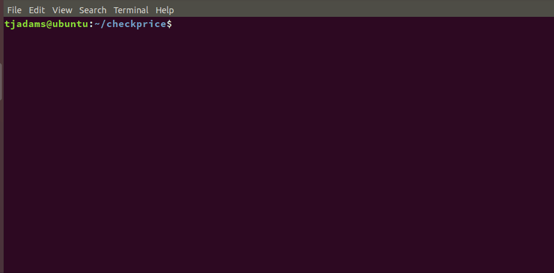
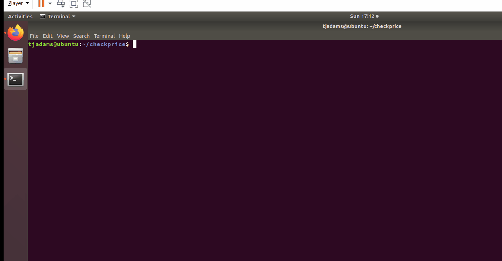
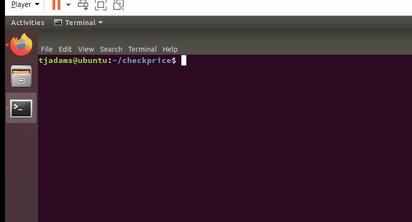

# Price Tracker
Use this script to avoid manually checking the price for a product you're
interested in. Utilizing this script and Cron, you can input the relevant HTML
parameters and have your raspberry pi check the price of an item for you.

This script uses [Twilio](https://www.twilio.com/) to send a text message any time the price changes or
your target price for the product has been reached.

## Requirements
- Dedicated computer to run script (raspberry pi works perfectly fine)
- A Twilio Account (Free)
- Python 3 and Python libraries including **sys, json, requests, bs4, twilio,
& price_parser**

## Usage
1. Put script on computer that will be acting as a server
2. Fill in Twilio information in twilio_pass.py
3. Run `./check_price.py add` and follow prompts
4. Schedule `./check_price.py run` with Cron to periodically check for the price
5. Add products as needed and change scheduling
6. run `./check_price.py force-text` to test out and get a text message

## Example
1. Put in the twilio information

2. Add product you want to get price of

This product doesn't specify the currency and price in separate html tags so leave the second answers blank

3. Test out the script and get a text notification of price

Once you've verified this works you can use Cron and schedule periodic price checks

## Limitations
- Websites that have a single product with multiple variations can cause issues.
- Initial Price Check may have wrong previous price

